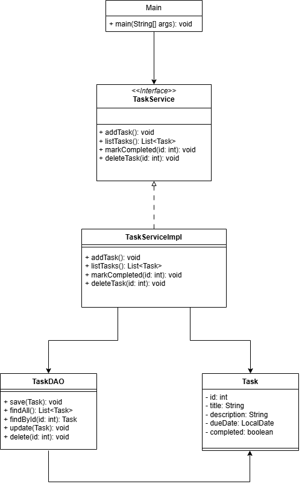

# 🗂️ Task Manager (Java Console App)

A simple task manager built using core Java, Hibernate, and PostgreSQL. This project helps solidify knowledge of Java fundamentals and database interaction without using Spring (yet!).

## 🧰 Technologies Used

- Java 17
- Hibernate ORM
- PostgreSQL
- IntelliJ IDEA

## 🛠️ Setup & Running the Project

1. Clone the repository
	- git clone https://github.com/Josephj9720/task-manager.git
	
2. Configure your PostgreSQL database
	- Create a file named src/main/resources/db.properties by copying and modifying the sample file:
		- cp src/main/resources/db.sample.properties src/main/resources/db.properties

3. Run `Main.java`
	- Open Main.java in IntelliJ and run it.

## 🧩 Features

- Create, update, delete, and list tasks
- Hibernate-based ORM mapping
- Clean DAO-Service-Model architecture
- Exception handling and logging

## 📐 UML Diagram

## ✍️ Author

Jordan Joseph  
[jordanjoseph.dev](https://jordanjoseph.dev)

## 📜 License

This project is licensed under the [MIT License](LICENSE).