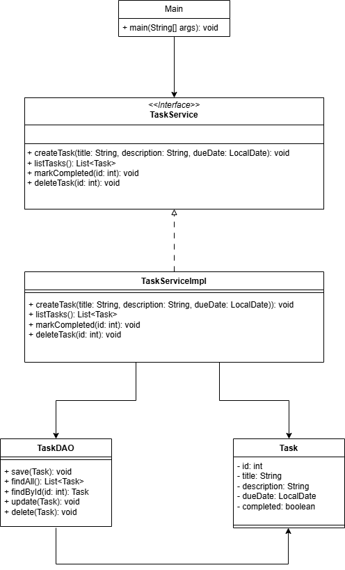

# 🗂️ Task Manager (Java Console App)

A simple task manager built using core Java, Hibernate, and PostgreSQL. This project helps solidify knowledge of Java fundamentals and database interaction without using Spring (yet!).

## 🧰 Technologies Used

- Java 17
- Hibernate ORM
- PostgreSQL
- IntelliJ IDEA

## 🛠️ Setup & Running the Project

1. Clone the repository
2. Configure your PostgreSQL database in `db.properties`
3. Run `Main.java`

## 🧩 Features

- Create, update, delete, and list tasks
- Hibernate-based ORM mapping
- Clean DAO-Service-Model architecture
- Exception handling and logging

## 📐 UML Diagram

## ✍️ Author

Jordan Joseph  
[jordanjoseph.dev](https://jordanjoseph.dev)

## 📜 License

This project is licensed under the [MIT License](LICENSE).